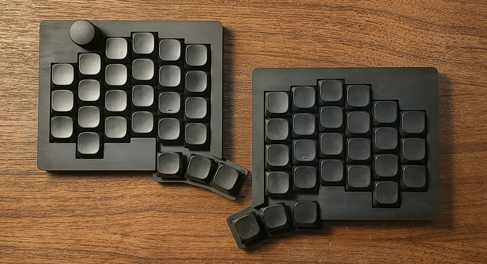

# NWSplit keyboard
NWSplit is a columnar staggered, split keyboard designed using Ergogen. Named after myself, NWS, because I suck at naming things.

 

________________________________________

## Features

- Columnar staggered
- 3 key thumb clusters with a wide (1.5u) center thumb key
- QMK and VIAL firmware
- Hot-swappable MX and Choc V2 sockets
- RP2040-zero controller
- Case and PCB designed entirely in [Ergogen](https://ergogen.xyz/) 

## Repo Structure
- `footprints/` - Custom footprints used in the PCB design in Ergogen
- `gerbers/` - Gerber files for manufacturing the PCBs
- `traced-pcbs/` - Autogenerated PCB files from Ergogen - traced
- `vial-qmk/` - Vial/QMK firmware files for the keyboard
- `images/` - Images related to the keyboard design
- `config.yaml` - Ergogen configuration file for the keyboard design

## Bill of Materials (BOM)
\#TODO

## Build Instructions
\#TODO

