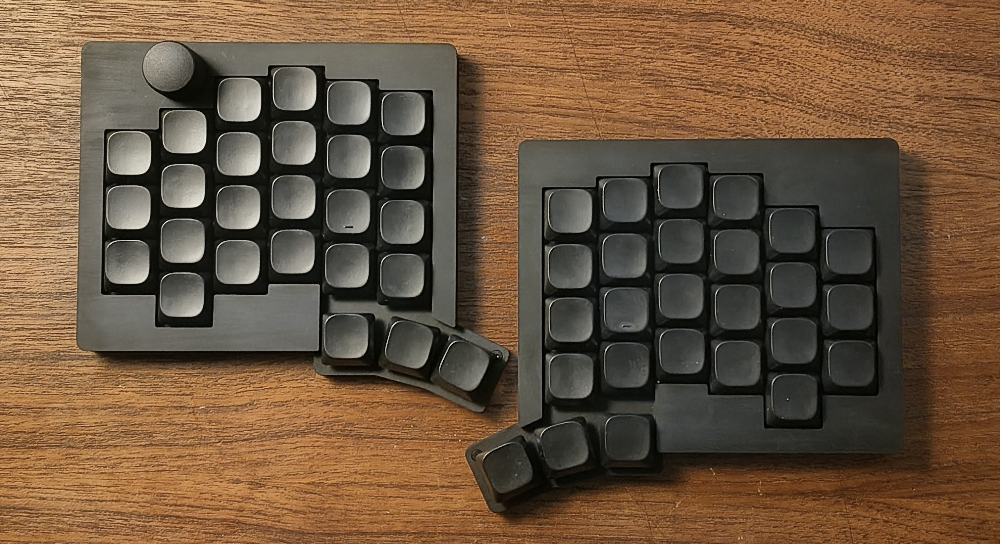

# NWSplit ⌨️

> A 52-key, column-staggered split ergonomic keyboard developed almost entirely through **Ergogen**.

The goal: build the *perfect* keyboard for me. Of course, getting there meant going through a handful of prototypes that didn't quite make the cut. Take a look at the [Graveyard](images/graveyard) to see the keyboards that didn't make the cut.

---

## ✨ Features
* **Declarative:** Designed in [Ergogen](https://ergogen.xyz/) (both case and PCB).
* **Firmware:** Powered by **QMK & VIAL** for real-time keymap customization without flashing.
* **Choc Switches:** Hot-swap support for Kailh Choc v1 and v2 switches.
* **Per-Key RGB:** SK6812 MINI-E lighting support.
* **Extra Inputs:** Optional rotary encoder support (up to 2).

---

## 📂 Repository Structure

* `3d/` — 3D printable models (`.stl`) for the keyboard and expansion modules.
* `firmware/` — Vial/QMK firmware source files and layouts.
* `footprints/` — Custom Ergogen and KiCad footprints.
* `images/` — Renders, wiring diagrams, and build photos.
* `production/` — Ready-to-use PCB production files (Gerbers).
* `traced-pcbs/` — Autogenerated and manually traced KiCad PCB projects.
* `keyboard.yaml` — Ergogen configuration file for the main keyboard.
* `expansion.yaml` — Ergogen configuration file for the expansion modules.

---

## 🛒 Bill of Materials (BOM)

| Component | Description | Quantity | Notes |
| :--- | :--- | :---: | :--- |
| **PCB** | Gerber available in `production/` | 2 | Reversible (left and right use the exact same PCB) |
| **Diodes** | 1N4148, SOD123 | 52 | |
| **MCU** | Waveshare RP2040-Zero | 2 | Clones work too just verify pinout compatibility |
| **TRRS Connector** | PJ320A Jack | 2 | |
| **Switches** | Kailh Choc V1/V2 | 52 | Dont use V2 with guide pin (stock red/blue/brown) |
| **Keycaps** | Low-profile keycaps of choice | 52 | THT or LPF profiles recommended |
| **Heat Inserts** | M2 L3 OD3.5 (or OD3 for resin prints) | 12 | |
| **Per-Key LEDs** | SK6812 MINI-E | 52 | *Optional* |
| **Rotary Encoder** | EC11 / EC12 | 0–2 | *Optional* (supports button click) |
| **Pogo Connectors** | Angled 6-pin Magnetic Pogo Pins | 0–2 | *Optional* (used for experimental modular connections) |

---

## 🚀 Roadmap & TODO

- [ ] **Build Instructions:** Step-by-step assembly guide.
- [ ] **Sandwitch case:** Cheap case option without 3d printing.
- [ ] **Expansion Boards:** 
  - [ ] Trackball module
  - [ ] Trackpad module
- [ ] **Images:** Add build process and final images of the keyboard and expansions.
- [ ] **Graveyard:** Show what keyboards didn't make the cut.

---

## 💡 Inspiration

NWSplit draws design inspiration from some projects:
* [christianselig/caldera](https://christianselig.com/2024/07/caldera-keyboard/)
* [achyudh/karma](https://github.com/achyudh/karma)
* [carrefinho/forager](https://github.com/carrefinho/forager)

